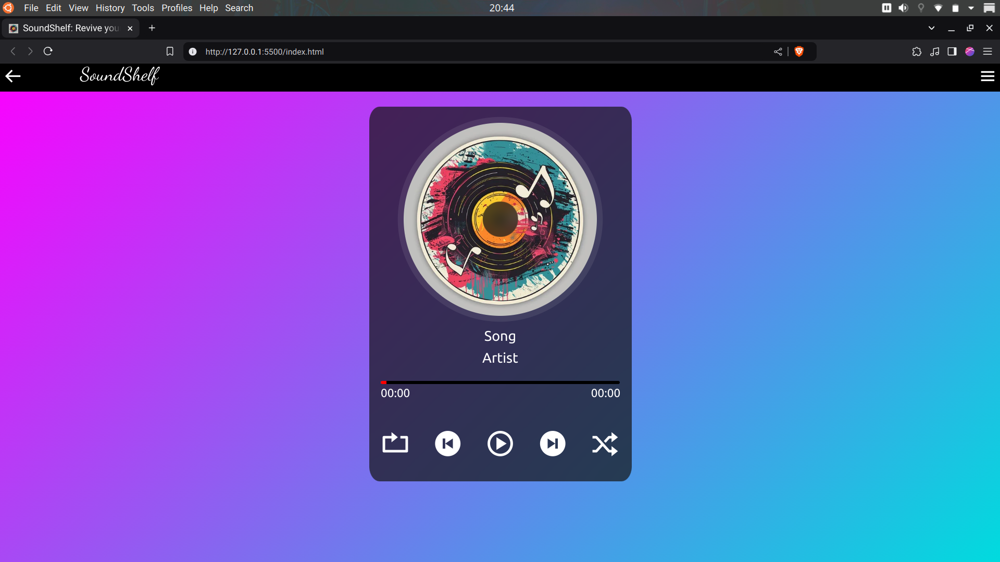
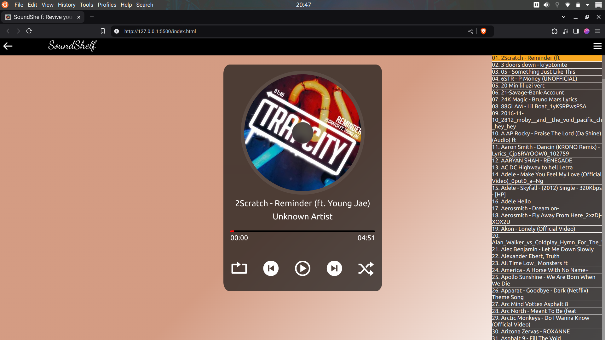

# SoundShelf
Revive Your Classic Downloads

# Table of Contents

- [Overview](#overview)
- [Features](#features)
- [Usage](#usage)
- [Screenshots](#screenshots)
- [Technologies Used](#technologies-used)
- [Installation](#installation)
- [Credits](#credits)


## Overview
SoundShelf is a modern, web-based Music Player that brings the Music-Stash lying in your memory to life with a dynamic and responsive interface. Built with Vanilla Javascript it offers a seamless music listening experience with vinyl-inspired visualizations.

## Features
- **Plug and Play**: Upload and Play your music files in your browser.
- **Interactive Sidebar**: All selected songs for playback can be viewed in a sidebar with the currently playing song being highlighted.
- **Dynamic VIsuals**: Songs' Album Cover (if present) rotates during playback
- **Adaptive Color-Scheme**: The background color changes dynamically by choosing the most dominant color from the album-art (if available) dynamically.
- **Smart Playback for Shuffle**: If songs are played with shuffle button on then on pressing the previous button the shuffling won't work and previously played songs with shuffle button will be played unitl the first one played.
- **Responsive-Design**: Works seemlessly on Desktop,Tablets and mobiles with different viewports.

## Usage
- **How to upload music**: Select the arrow on the top left corner of the webpage it will open a window in which navigaten to the location where music is stored and press open to load it.
- **Playlist SideBar**: Click on the button at the top right corner which will show you the list of all the songs selected for playback with the currently played song highlighted in orange color. 
- **Available controls**: Buttons for Play ,Pause, Repeat and Shuffle along with a slider to alter playback. 
### Keyboard shortcuts: 
- Left & Right Arrow Keys to play previous and next songs respecitvely. 
- Spacebar to Start & Stop the playback.
- Up & Down Arrow Keys to increase & decrease the volume. 

## Screenshots
- Main interface

- Playlist view

- Demo Video 


## Technologies Used
- HTML5 for Audio API and music playback 
- CSS for responsive design and animations 
- Vanilla JavaScript for core functionality
### Libraries:-
- jsmediatags for reading binary metadata from songs
- ColorThief for extracting colors from album art

## Installation 
1. Clone the repository:-
   ```bash 
   git clone https://github.com/RaghavV8/SoundShelf.git

## Credits
* [Color Thief](https://github.com/lokesh/color-thief) - Created by [Lokesh Dhakar](https://github.com/lokesh)
* [jsmediatags](https://github.com/aadsm/jsmediatags) - Created by [António Afonso](https://github.com/)